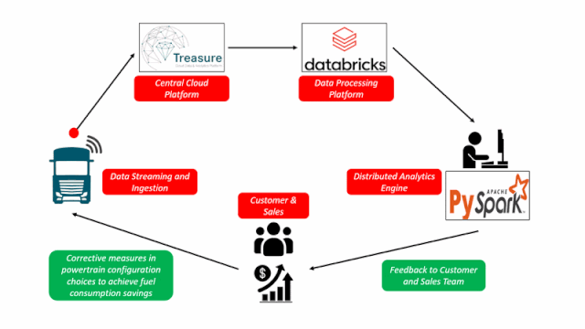
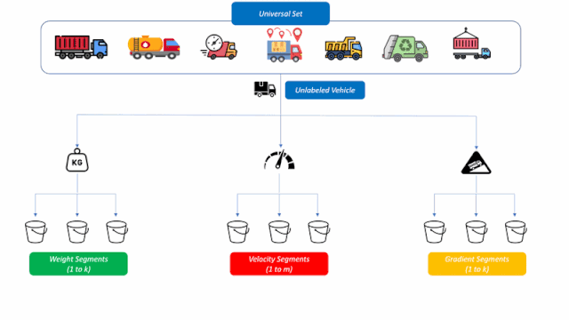
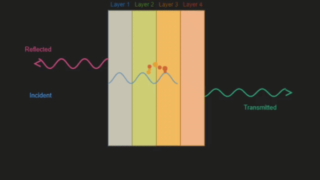
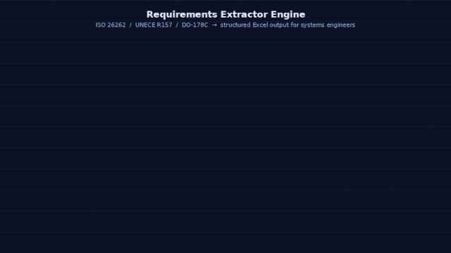
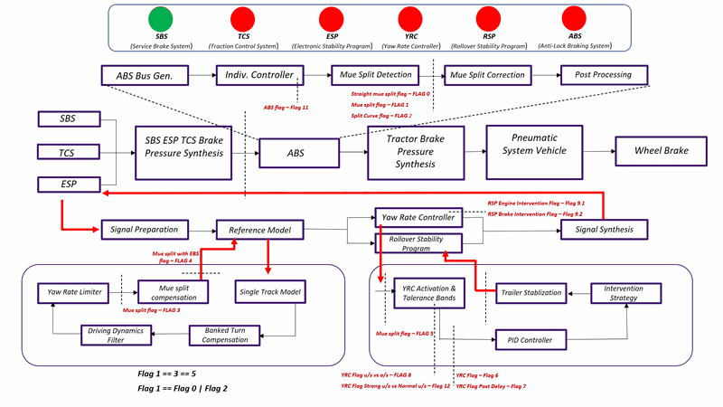

# 🚗 About Me

Hi, I'm Pradeep, an M.Sc. Automotive Engineering graduate passionate about building intelligent mobility solutions. I have ~4 years of experience working across the automotive domain in different engineering roles.

My areas of expertise include:

- 🤖 AI/ML for mobility applications
- 🚘 ADAS & autonomous systems
- ⚙️ Systems engineering, model-based design, testing & validation

---

# 🛠️ Skills & Technologies

### Programming & Development Toolkit

### Simulation Toolkit

### AI / ML Techniques

### ADAS & Autonomous Systems

### Systems Engineering/ V&V

---

# 🔍 Featured Work

### 🤖 AI/ML for Mobility

<table>
  <tr>
    <td align="center">
       
      <b>Commercial-Vehicle-Telemetry-Analytics-Pipeline</b> 
      🔗 <a  href="https://github.com/pradeepmadanagopalan-hash/Commercial-Vehicle-Telemetry-Analytics-Pipeline"> View Repository</a>
    </td>
    <td align="center">
       
      <b>Unsupervised-Vehicle-Telemetry-Clustering</b> 
     🔗  <a href="https://github.com/pradeepmadanagopalan-hash/Unsupervised-Vehicle-Telemetry-Clustering"> View Repository</a>
    </td>
    <td align="center">
       
      <b>Supervised-Automotive-NVH-Acoustics-Modeling</b> 
     🔗  <a href="https://github.com/pradeepmadanagopalan-hash/Supervised-Automotive-NVH-Acoustic-Modeling"> View Repository</a>
    </td>
  </tr>
</table>

### 🚘 ADAS & Autonomous Systems

<table>
  <tr>
    <td align="center">
       
      <b>CARLA-Path-Tracking-Controller</b> 
      🔗 <a  href="https://github.com/pradeepmadanagopalan-hash/CARLA-Path-Tracking-Controller"> View Repository</a>
    </td>
    <td align="center">
       
      <b>Multi-Sensor-EKF-Localization</b> 
     🔗  <a href="https://github.com/pradeepmadanagopalan-hash/Multi-Sensor-EKF-Localization"> View Repository</a>
    </td>
  </tr>
</table>

### ⚙️ Systems Engineering/ Model Development/ V&V

<table>
  <tr>
    <td align="center">
       
      <b>Requirements-Extraction-Engine</b> 
      🔗 <a  href="https://github.com/pradeepmadanagopalan-hash/Requirements-Extraction-Engine"> View Repository</a>
    </td>
    <td align="center">
       
      <b>EV-Slip-Control-Digital-Twin</b> 
     🔗  <a href="https://github.com/pradeepmadanagopalan-hash/EV-Slip-Control-Digital-Twin"> View Repository</a>
    </td>
    <td align="center">
       
      <b>DAS-Development-Validation-Verification</b> 
      🔗 <a  href="https://github.com/pradeepmadanagopalan-hash/DAS-Development-Validation-Verification"> View Repository</a>
    </td>
  </tr>
</table>

---

## 🔗 Connect with Me

 
